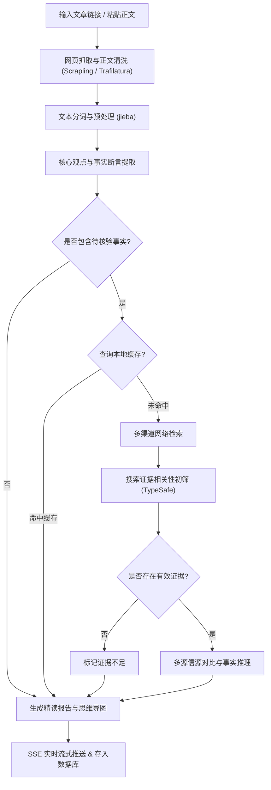

# OmniDigest · 长文深度精读与事实核验工具

针对微信公众号、知乎专栏等长文内容中「篇幅冗长、信息密度低、关键论点真假难辨」的问题，OmniDigest 提供**文章快速解析、核心内容提炼、事实论点联网核验**与**流式报告生成**的一站式工具。

系统基于 FastAPI 与 LangGraph 构建，结合网页抓取、中文分词预处理、搜索过滤门控与大模型推理，支持对文章中的可疑陈述进行多信源检索核查，并生成包含核心摘要、思维导图与核查结论的精读报告。

---

## 核心功能

- **多平台网页抓取与正文清洗**：基于 Scrapling 与 Trafilatura，针对微信公众号、知乎专栏等平台定制解析规则，自动剔除广告、推荐与评论等噪音，提取纯净的正文内容。
- **关键论点与事实陈述提取**：利用 jieba 分词预处理结合大模型，识别正文中的核心论点与具体事实陈述，补齐代词指代（如还原“该公司”、“受害者”等），确保提取的论点具备完整上下文。
- **自动化联网事实核验**：
  - 针对提取的事实断言自动构造搜索查询，从主流搜索引擎聚合候选证据；
  - 接入 TypeSafe 快速过滤无关搜索结果，减少无效的大模型推理调用；
  - 结合信源权威度分级（官方机构、主流媒体、一般自媒体）与多方信源交叉对比，给出核验结论与置信度。
- **多级缓存设计**：提供 SQLite 本地持久化缓存、Redis 与内存缓存支持，对已核验的事实陈述（72小时）与搜索结果（12小时）进行缓存，避免重复检索与调用。
- **SSE 实时流式响应**：全流程通过 Server-Sent Events 流式推流，前端实时展示正文抓取、论点提取、检索核对与报告生成的进度与日志。
- **历史记录与语义检索**：所有已分析文章与精读报告均落库存储，支持通过 BM25 全文检索与向量相似度混合检索历史论点与报告内容。

---

## 架构流程



---

## 技术架构

| 模块 | 技术选型 | 说明 |
| --- | --- | --- |
| **Web 框架** | FastAPI + Uvicorn + Pydantic v2 | 异步接口路由与 SSE 流式事件推送 |
| **流程编排** | LangGraph (StateGraph) | 状态流转、条件分支与核查流水线编排 |
| **文本预处理** | jieba + TextRank | 中文分句、主观句过滤与关键词提取 |
| **证据初筛** | TypeSafe SDK (`typesafe-sdk`) | 搜索候选结果相关性快速门控 |
| **大语言模型** | DeepSeek (`deepseek-chat`) / OpenAI 兼容接口 | 论点提取、多源事实交叉推理与综合报告生成 |
| **缓存机制** | SQLite (`aiosqlite`) + Redis + 本地内存 | 断言核查缓存、搜索缓存与提示词优化 |
| **网页抓取** | Scrapling (TLS 指纹) + Trafilatura | 微信/知乎反爬路由与正文抽取 |
| **联网检索** | DuckDuckGo / Tavily / Bing 聚合 | 权威信源检索与域名去重 |
| **数据库** | SQLAlchemy 2.0 (async) · SQLite / PostgreSQL | 文章数据、精读报告存储与向量检索 |

---

## 快速开始

### 1. 本地运行

```bash
# 1. 创建并激活虚拟环境
python -m venv .venv
# Windows:
.\.venv\Scripts\activate
# Linux/macOS:
source .venv/bin/activate

# 2. 安装依赖
pip install -r requirements.txt

# 3. 复制环境变量配置并填写 API Key
cp .env.example .env

# 4. 启动服务
uvicorn app.main:app --reload --port 8000
```

启动后访问：
- Web 工作台：<http://localhost:8000>
- API 接口文档：<http://localhost:8000/docs>

> 默认采用本地 SQLite 数据库（`omnidigest.db` 与 `data/cache.db`），无需安装外部数据库即可直接运行。

### 2. Docker Compose 部署

```bash
cp .env.example .env
docker compose up -d --build
```

---

## 项目目录结构

```text
app/
├── main.py               # FastAPI 应用入口、中间件配置
├── config.py             # 配置管理 (pydantic-settings)
├── core/
│   ├── cache.py          # SQLite / Redis / 内存多级缓存实现
│   ├── typesafe.py       # TypeSafe 证据初筛门控
│   ├── nlp.py            # jieba 分词预处理与关键词提取
│   └── authority.py      # 信源权威度分级与域名提取
├── crawler/              # 网页爬虫与微信/知乎专用清洗
├── agent/
│   ├── graph.py          # LangGraph 流水线编排
│   ├── llm.py            # 大模型客户端调用封装
│   ├── state.py          # 全链路状态数据结构定义
│   ├── nodes/            # 论点提取、事实核查、报告合成等各阶段节点
│   └── tools/search.py   # 搜索引擎聚合检索与缓存
├── db/                   # 数据库连接、ORM 模型与向量存储
├── schemas/              # 请求与响应的 Pydantic 数据模型
└── static/               # 前端单页工作台 (index.html)
```

---

## 常见环境变量

| 环境变量 | 必填 | 说明 | 示例 |
| --- | :---: | --- | --- |
| `OPENAI_API_KEY` | **是** | 模型 API Key | `sk-xxxx` |
| `OPENAI_BASE_URL` | 否 | API 接口地址 | `https://api.deepseek.com/v1` |
| `MODEL_NAME` | 否 | 模型名称 | `deepseek-chat` |
| `TYPESAFE_API_KEY` | 否 | TypeSafe API Key（用于证据初筛） | `ts-xxxx` |
| `TYPESAFE_ENDPOINT`| 否 | TypeSafe 接口地址 | `https://api.typesafe.ai` |
| `TAVILY_API_KEY` | 否 | Tavily 搜索 Key（未配置则使用免 Key 检索） | — |
| `DATABASE_URL` | 否 | 数据库连接字符串 | `sqlite+aiosqlite:///./omnidigest.db` |
| `REDIS_URL` | 否 | Redis 地址（可选） | `redis://localhost:6379/0` |
