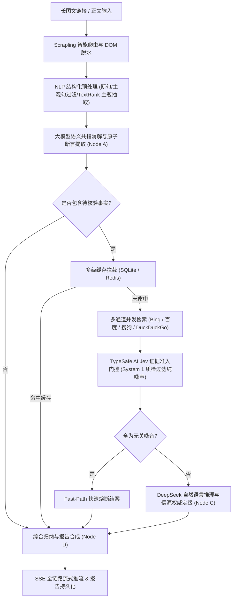

# OmniDigest · 跨平台内容智能脱水与动态事实核查智能体平台

针对微信公众号、知乎专栏等平台长图文内容「信息密度低、阅读成本高、夸大虚假难以甄别」的痛点，OmniDigest 提供**文章秒级解析、核心逻辑骨架提炼、可疑断言自动化联网核验**与**流式报告生成**的完整闭环。

系统依托 FastAPI + asyncio 异步底座，通过 LangGraph 编排带条件分支与反思机制的智能体工作流，融合 **jieba NLP 结构化初筛**、**TypeSafe AI Jev 官方质检门控**、**多级持久化缓存（SQLite/Redis/Memory）**与 **PostgreSQL/pgvector 混合存储**，实现兼具高吞吐、低推理成本与可信事实溯源的工业级工程落地。

---

## 核心特性

- **高鲁棒性跨模态文本摄入** — 基于 [Scrapling](https://github.com/D4Vinci/Scrapling) 隐蔽反反爬抓取引擎（模拟最新 Chrome TLS/JA3 浏览器指纹与真实标头），针对微信 / 知乎构建专有解析路由与 Selector 结构化抽取，结合 trafilatura 与 markdownify 剔除导航、广告、评论等噪声 DOM，高保真输出纯净 Markdown 正文。
- **NLP 结构化初筛与原子共指消解（Coreference Resolution）** — 集成轻量级中文 NLP 引擎（jieba），实现规范断句、主观情绪/设问过滤与 TextRank 主题实体抽取；大模型专注进行指示代词（“他”、“该案”、“嫌疑人”）自然还原与前因背景自洽补齐，杜绝机械模板拼贴与负向避险拒答，长文事实断言抽取召回率大幅提升。
- **主题显著度对齐与修辞类比过滤** — 自动识别并过滤文章作者借题发挥引用的历史典故、外围类比或国外案例（如讨论本地事件时随口对比的国外历史事件），紧密围绕核心事件主体展开事实核验。
- **TypeSafe AI Jev 官方接口深度质检门控** — 接入 TypeSafe 官方 SDK (`typesafe-sdk`)，利用 System One 快思考 `Choice` 原语（`supports` / `contradicts` / `says_nothing`）对搜索引擎召回的候选证据进行批量语义相关性质检，精准剔除泛百科与城市背景噪声；实现纯噪声快速熔断（Fast-Path Exit），减少昂贵 LLM 冗余推理。
- **权威信源分级评定（Tier 1/2/3）与证据交叉法庭** — 建立信源权威度分级评估体系（Tier 1 官方/顶刊、Tier 2 主流媒体、Tier 3 一般信源），统计独立根域名多样性，支持多方信源交叉互证；严格区分瞬时过程量与终局结果量，杜绝凭空杜撰。
- **三层容灾多级持久化缓存体系** — 构建 SQLite 本地持久化缓存 (`data/cache.db`) + Redis + 内存字典三层容灾底座：
  - **断言级核验缓存**（TTL 72小时）：自洽语境哈希防跨文章同名碰撞，同类事实秒级命中；
  - **检索证据缓存**（TTL 12小时）：阻断重复搜索引擎调用；
  - **Prompt Cache 友好设计**：置顶静态规则，对齐 DeepSeek 上下文缓存，费用直降 90%。
- **全链路 SSE 流式推流** — 从「爬取正文」「断言解析」「搜索比对」到「最终报告生成」，全过程通过打字机效果逐步渲染，无需忍受长推理白屏。
- **双轨持久化与语义反查** — 全文快照与元数据落库，核验摘要经向量嵌入后支持跨文章自然语言语义检索（pgvector）。

---

## 架构流程图



---

## 技术栈

| 模块 | 技术选型 | 功能说明 |
| --- | --- | --- |
| **Web 异步底座** | FastAPI + Uvicorn + Pydantic v2 | 异步高并发 API 路由与全双工 SSE 推流 |
| **智能体工作流** | LangGraph (StateGraph) | 状态流转、条件路由与动态事实核查分支 |
| **NLP 预处理** | jieba + TextRank | 中文规范断句、主观情绪过滤、主题实体显著度计算 |
| **证据语义门控** | TypeSafe AI Jev (`typesafe-sdk`) | System One 原语级快速证据质检与噪声快速熔断 |
| **大模型认知核验** | DeepSeek (`deepseek-chat`) / OpenAI | 语义共指消解、严苛自然语言推理 (NLI)、多源交叉裁判 |
| **多级持久化缓存** | SQLite (`aiosqlite`) + Redis + Memory | 72h 断言缓存、12h 搜索缓存、DeepSeek Prompt Cache 对齐 |
| **爬虫与正文脱水** | Scrapling (TLS/JA3指纹) + trafilatura | 微信/知乎专有防反爬路由与 DOM 噪音清洗 |
| **全网多通道检索** | 多源引擎聚合 (DuckDuckGo / Tavily / Bing) | 自动化权威信源召回与根域名去重聚合 |
| **存储底座** | SQLAlchemy 2.0 async · PostgreSQL/pgvector / SQLite | 全文快照持久化与跨篇自然语言语义反查 |

---

## 快速开始

### 1. 本地开发（零门槛模式）

```bash
# 创建并激活虚拟环境
python -m venv .venv
source .venv/bin/activate        # Windows: .venv\Scripts\activate

# 安装依赖
pip install -r requirements.txt

# 配置环境变量
cp .env.example .env             # 填入你的 OPENAI_API_KEY 与可选的 TYPESAFE_API_KEY

# 启动开发服务器
uvicorn app.main:app --reload --port 8000
```

打开浏览器访问工作台：<http://localhost:8000>；接口交互文档见：<http://localhost:8000/docs>。

> 本地默认使用轻量级 SQLite（`omnidigest.db` 与 `data/cache.db`），零外部环境依赖即可顺畅运行全功能工作流。

### 2. Docker Compose 一键部署（生产模式）

```bash
cp .env.example .env             # 填入生产环境配置
docker compose up -d --build
```

自动拉起应用服务、PostgreSQL/pgvector 向量数据库以及 Redis 实例。

---

## 项目结构

```text
app/
├── main.py               # 应用生命周期、CORS 与中间件注册
├── config.py             # 环境变量统一配置中心 (pydantic-settings)
├── core/
│   ├── cache.py          # SQLite 本地持久化缓存 + Redis + 内存三层容灾
│   ├── typesafe.py       # TypeSafe AI Jev 官方 SDK 证据质检门控
│   ├── nlp.py            # jieba 断句、主观情绪过滤与 TextRank 主题实体抽取
│   └── authority.py      # 信源权威度分级评定 (Tier 1/2/3) 与独立域名解析
├── crawler/              # Scrapling 反反爬引擎 + 微信/知乎/通用清洗分发器
├── agent/
│   ├── graph.py          # LangGraph 核心图编排与节点条件路由
│   ├── llm.py            # OpenAI 兼容客户端封装与静态提示词优化
│   ├── state.py          # DigestState 智能体全链路共享状态定义
│   ├── nodes/            # claim_extract / fact_check / synthesize / router 核心节点
│   └── tools/search.py   # 多源检索聚合与结果持久化缓存
├── db/                   # 异步 SQLAlchemy 会话、ORM 模型与 pgvector 存取
├── schemas/              # Pydantic 请求响应模型与数据校验
└── static/               # 现代化 Web 端响应式交互工作台 (index.html)
```

---

## 环境变量配置

详见 [.env.example](.env.example)，核心参数：

| 环境变量 | 必填 | 说明 | 默认 / 示例值 |
| --- | :---: | --- | --- |
| `OPENAI_API_KEY` | **是** | 大模型 API Key | `sk-xxxx` |
| `OPENAI_BASE_URL` | 否 | OpenAI 规范服务基地址 | `https://api.deepseek.com/v1` |
| `MODEL_NAME` | 否 | 推理模型名称 | `deepseek-chat` |
| `TYPESAFE_API_KEY` | 否 | TypeSafe AI Jev 官方接口密钥（开启快思考证据质检） | `ts-xxxx` |
| `TYPESAFE_ENDPOINT`| 否 | TypeSafe API 端点 | `https://api.typesafe.ai` |
| `TAVILY_API_KEY` | 否 | Tavily 搜索服务密钥（未配置则自动使用多通道免 Key 检索） | — |
| `DATABASE_URL` | 否 | 数据库连接串 | `sqlite+aiosqlite:///./omnidigest.db` |
| `REDIS_URL` | 否 | Redis 连接地址 | `redis://localhost:6379/0` |
