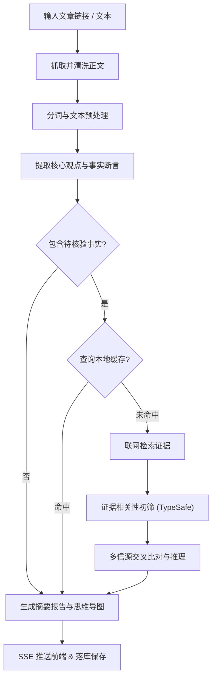

# OmniDigest

一个长文内容脱水与事实核验工具。输入微信公众号或知乎专栏链接，自动提取文章核心观点，并联网对关键事实陈述进行核查与交叉比对，最终输出带思维导图的精简报告。

---

## 主要功能

- **网页抓取与正文清洗**：支持微信公众号、知乎专栏等长文链接，自动剔除广告、推荐与评论，提取正文纯文本。
- **核心论点提取**：对正文进行分句和代词指代还原，提取出具有明确事实命题的核心陈述。
- **联网事实核验**：
  - 针对事实断言生成搜索词，聚合搜索引擎结果；
  - 使用 TypeSafe 进行候选结果相关性初筛；
  - 结合权威信源与多方证据交叉比对，给出核查结论。
- **混合检索（历史反查）**：
  - 支持对历史分析过的文章进行语义反查；
  - 结合 BM25 全文检索（标题加权）与本地向量模型（`BAAI/bge-small-zh-v1.5`），免额外配置；
  - 内置常见形近字纠错（如“兵乓球”自动识别为“乒乓球”），并对低相关内容做阈值过滤。
- **多级缓存**：支持 SQLite、Redis 与内存缓存，已核验的断言与搜索结果会自动缓存，避免重复请求。
- **SSE 流式响应**：分析过程通过 Server-Sent Events 实时推送至前端页面。

---

## 运行流程



---

## 技术选型

- **后端框架**：FastAPI / Uvicorn / Pydantic v2
- **工作流编排**：LangGraph
- **网页抓取**：Scrapling / Trafilatura
- **文本处理**：jieba
- **检索引擎**：BM25 + FastEmbed（ONNX 本地 CPU 推理，支持外接 OpenAI 兼容向量接口）
- **核查门控**：TypeSafe SDK
- **主模型**：DeepSeek / OpenAI 兼容接口
- **存储**：SQLAlchemy 2.0（SQLite / PostgreSQL）+ Redis

---

## 快速开始

### 1. 本地启动

```bash
# 创建并激活虚拟环境
python -m venv .venv
# Windows:
.\.venv\Scripts\activate
# Linux/macOS:
source .venv/bin/activate

# 安装依赖
pip install -r requirements.txt

# 配置环境变量
cp .env.example .env
# 编辑 .env 填入你的 OPENAI_API_KEY 等配置

# 启动服务
uvicorn app.main:app --reload --port 8000
```

服务启动后：
- 前端页面：`http://localhost:8000`
- API 文档：`http://localhost:8000/docs`

> 默认使用本地 SQLite 存储（`omnidigest.db` 与 `data/cache.db`），无需配置外部数据库即可直接运行。

### 2. Docker 部署

```bash
cp .env.example .env
docker compose up -d --build
```

---

## 目录结构

```text
app/
├── main.py               # 应用入口
├── config.py             # 配置项 (pydantic-settings)
├── core/
│   ├── cache.py          # SQLite / Redis 多级缓存
│   ├── typesafe.py       # TypeSafe 证据过滤
│   ├── nlp.py            # 分词与实体提取
│   └── authority.py      # 信源权威度分级
├── crawler/              # 网页抓取与正文清洗
├── agent/
│   ├── graph.py          # LangGraph 流程定义
│   ├── llm.py            # LLM 封装
│   ├── state.py          # 状态定义
│   ├── nodes/            # 抽取、核查、报告合成节点
│   └── tools/search.py   # 搜索工具与缓存
├── db/                   # 数据库与混合检索引擎
├── schemas/              # Pydantic 模型
└── static/               # 前端页面
```

---

## 环境变量说明

| 变量名 | 是否必填 | 说明 | 示例 |
| --- | :---: | --- | --- |
| `OPENAI_API_KEY` | 是 | 大模型 API Key | `sk-xxxx` |
| `OPENAI_BASE_URL` | 否 | 大模型 API 地址 | `https://api.deepseek.com/v1` |
| `MODEL_NAME` | 否 | 模型名称 | `deepseek-chat` |
| `TYPESAFE_API_KEY` | 否 | TypeSafe API Key（用于初筛证据） | `ts-xxxx` |
| `TYPESAFE_ENDPOINT`| 否 | TypeSafe 接口地址 | `https://api.typesafe.ai` |
| `EMBEDDING_API_KEY` | 否 | 独立向量 API Key（若未设置则使用本地向量） | `sk-xxxx` |
| `EMBEDDING_BASE_URL`| 否 | 独立向量 API 地址（如 SiliconFlow / OpenAI） | `https://api.siliconflow.cn/v1` |
| `EMBEDDING_MODEL_NAME` | 否 | 向量模型（默认本地 BAAI/bge-small-zh-v1.5） | `BAAI/bge-small-zh-v1.5` |
| `TAVILY_API_KEY` | 否 | Tavily 搜索 Key（未配置则使用内置免 Key 搜索） | — |
| `DATABASE_URL` | 否 | 数据库连接串 | `sqlite+aiosqlite:///./omnidigest.db` |
| `REDIS_URL` | 否 | Redis 地址（可选） | `redis://localhost:6379/0` |
